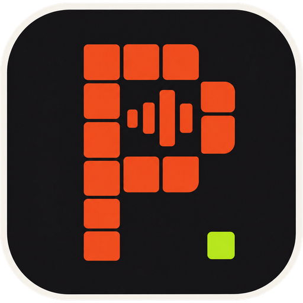
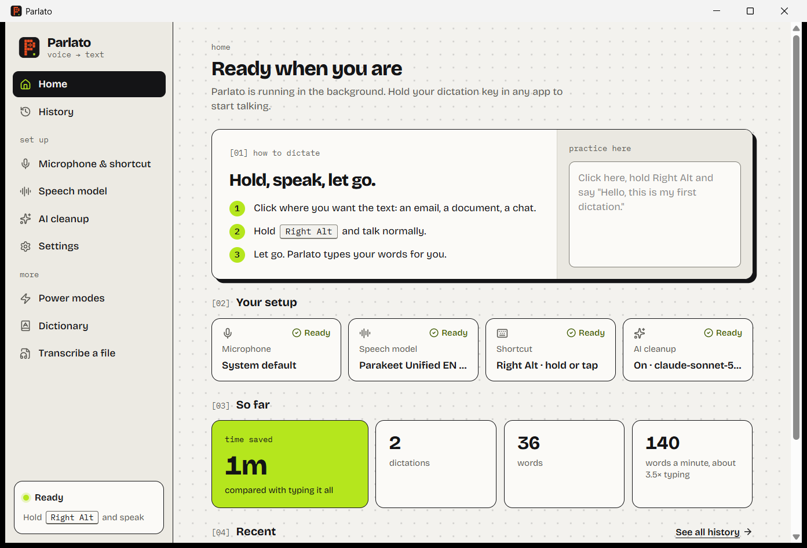

<div align="center">
  
  <h1>Parlato</h1>
  <p>Free voice dictation for Windows. Hold a key, speak, let go: your words are typed wherever your cursor is.</p>
  <p>
    <a href="https://github.com/mmnzns/Parlato/releases/latest">Download</a>
    &nbsp;&middot;&nbsp;
    <a href="https://github.com/mmnzns/Parlato/issues">Help &amp; feedback</a>
    &nbsp;&middot;&nbsp;
    <a href="CHANGELOG.md">What's new</a>
  </p>
  
  
  
</div>

<br>



> Parlato is a fork of [Parla](https://github.com/LitteRabbit-37/Parla) by
> Florian ([LitteRabbit-37](https://github.com/LitteRabbit-37)), renamed with
> the author's permission. Parla is itself a Windows re-implementation of
> [VoiceInk](https://github.com/Beingpax/VoiceInk) by Pax, for macOS. Parlato
> keeps Parla's engine and adds its own interface, model choices and
> wording. It is made by [Craft Concepts Digital](https://craftconceptsdigital.com).

## What it does

- **Dictate anywhere.** Hold your shortcut key (Right Alt by default) in any
  app: an email, a document, a chat. Let go, and Parlato types what you said.
- **Private by default.** Speech models run on your own PC. Nothing leaves
  it unless you choose an online service.
- **AI cleanup (optional).** A language model can tidy up what you said:
  punctuation, filler words, self-corrections, or a whole rewrite as an
  email. It can run on your PC or through a service you already use.
- **Power modes.** Different settings per app or website, switched
  automatically (for example a formal email style in Outlook).
- **Personal dictionary.** Words and names Parlato should always spell your
  way.
- **History.** Every dictation is kept on your PC, with the recording, so you
  can play it back or transcribe it again with another model.
- **Transcribe a file.** Drop in an audio or video file and get the text.
- **English, French and Spanish** interface.

## Download and install

1. Go to the [latest release](https://github.com/mmnzns/Parlato/releases/latest)
   and download `Parlato_x.y.z_x64-setup.exe`.
2. Run it. Parlato is a free project and is not code-signed, so the first
   time Windows shows **"Windows protected your PC"**. Click **More info**,
   then **Run anyway**. The installer is built from the source code in this
   repository.
3. Parlato opens a short setup: pick your microphone, your shortcut and a
   speech model.

Parlato runs in the system tray and updates itself: when a new version is
published here, it offers to install it. Updates are signed, and Parlato
refuses any update that isn't.

Works on Windows 10 (22H2) and Windows 11, on any x64 PC. Everything runs on
the processor, no graphics card needed.

## Speech models

Pick a model on the **Speech model** page. Models on this PC download once
and then work offline.

| Runs | Company | Models |
|---|---|---|
| On this PC | NVIDIA | Parakeet Unified EN 0.6B (best for English), Parakeet Ultra and Parakeet TDT 0.6B v2 and v3 (25 European languages), Nemotron 3.5 ASR 0.6B (35 languages) |
| On this PC | OpenAI | Whisper tiny, base, small, medium, large v2, large v3, large v3 turbo (99 languages), plus your own `.bin` models |
| Online | Your account | Groq, ElevenLabs, Deepgram, Mistral, Soniox, Speechmatics, Google Gemini, xAI, AssemblyAI |

## AI cleanup

| Runs | Options |
|---|---|
| On this PC | IBM Granite 4.2 3B, Meta Llama 3.2 3B, Google Gemma 2 2B, Microsoft Phi 3.5 Mini, or any model through [Ollama](https://ollama.com) |
| Online | Anthropic, OpenAI, Google Gemini, Mistral, Groq, Cerebras, OpenRouter, or any OpenAI-compatible service |

## Privacy

- **Your voice stays on your PC** when you use a model that runs on this PC,
  which is the default.
- **If you choose an online service**, your recording is sent to that
  company to be transcribed. If you turn on online AI cleanup, the text is
  sent to that company too. Parlato uses your own account key, and that
  company's terms apply.
- **Screen context** (off by default) reads the text of the window you are
  dictating into, so AI cleanup can match it. When it is on and AI cleanup
  runs online, that text is sent along.
- **Account keys** are stored in Windows Credential Manager, never in a file.
- **History** (text and recordings) is stored only on your PC. You choose how
  long it is kept, down to deleting it right after each dictation.
- **No analytics, no tracking, no account.** Parlato connects to the internet
  only to download the models you pick (from Hugging Face), to check this
  repository for updates, and to reach the online services you set up.

## Credits and licences

Parlato is free software under the [GNU GPL v3](LICENSE), like Parla and
VoiceInk before it. The full source is in this repository.

- **Parla** by Florian ([LitteRabbit-37](https://github.com/LitteRabbit-37)):
  the Windows engine Parlato is built on.
- **VoiceInk** by [Pax](https://github.com/Beingpax): the macOS app Parla
  re-implements.
- **Models** are made by NVIDIA, Moondream, OpenAI, IBM, Meta, Google and Microsoft, each
  under its own licence. Parlato does not include or host any model; they
  download from their original source. Authors, licences and required
  notices are in [THIRD_PARTY_NOTICES.md](THIRD_PARTY_NOTICES.md).
- **Built with** [Tauri](https://tauri.app/),
  [whisper.cpp](https://github.com/ggerganov/whisper.cpp),
  [llama.cpp](https://github.com/ggerganov/llama.cpp),
  [parakeet-rs](https://github.com/altunenes/parakeet-rs) and
  [ONNX Runtime](https://onnxruntime.ai/), React, shadcn/ui and many other
  open-source projects.

## Known limitation: apps run as administrator

The shortcut does nothing while an app started with **Run as administrator**
has focus. Windows blocks a normal app from seeing key presses aimed at an
administrator window. Fixing this properly needs a code-signed app, which
Parlato is not. Until then:

- Use a normal (non-administrator) window when you can.
- Or click a normal window, dictate, then switch back.

## Build from source

See [BUILDING.md](BUILDING.md) for the full instructions. On top of what it
lists, you need **CMake** and **LLVM** (set `LIBCLANG_PATH` to
`C:\Program Files\LLVM\bin`).

```bash
git clone https://github.com/mmnzns/Parlato.git
cd Parlato
npm install
npm run tauri dev
```

The first build compiles whisper.cpp, llama.cpp and ONNX Runtime from source
and takes 20 to 40 minutes. Later builds take seconds to minutes. A release
installer is built with `npm run tauri build`.

**Stack:** Tauri v2 (Rust) with a React 19 and TypeScript interface.
whisper.cpp through `whisper-rs`, NVIDIA models through `parakeet-rs` and
ONNX Runtime, local AI cleanup through `llama-cpp-2`, audio through `cpal`,
history in SQLite.

## Feedback

Bug reports and ideas are welcome in
[issues](https://github.com/mmnzns/Parlato/issues). See
[CONTRIBUTING.md](CONTRIBUTING.md) before sending a pull request.
