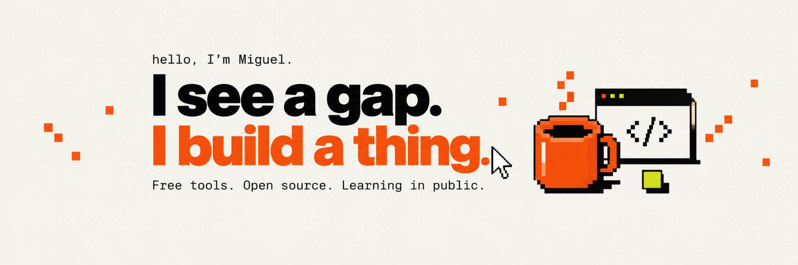
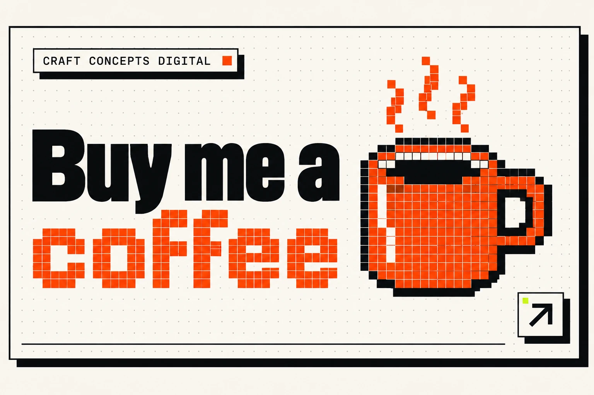

  

# Parlato FAQ

Common questions about Parlato. Something missing? Ask in
[Discussions](https://github.com/mmnzns/Parlato/discussions).

**Getting started**
- [Is Parlato really free?](#is-parlato-really-free)
- [Who makes Parlato?](#who-makes-parlato)
- [Which computers does it run on?](#which-computers-does-it-run-on)
- [Which speech model should I pick?](#which-speech-model-should-i-pick)
- [Which languages does it understand?](#which-languages-does-it-understand)

**Safety and signing**
- [Why does Windows say "Windows protected your PC"?](#why-does-windows-say-windows-protected-your-pc)
- [Why does my Mac say Parlato can't be opened?](#why-does-my-mac-say-parlato-cant-be-opened)
- [Why isn't Parlato signed?](#why-isnt-parlato-signed)
- [Is it safe to install?](#is-it-safe-to-install)

**Privacy**
- [Does my voice leave my computer?](#does-my-voice-leave-my-computer)
- [Does it work offline?](#does-it-work-offline)
- [Does AI cleanup cost money?](#does-ai-cleanup-cost-money)

**Using Parlato**
- [The shortcut does nothing. What now?](#the-shortcut-does-nothing-what-now)
- [What isn't on the Mac yet?](#what-isnt-on-the-mac-yet)
- [How do updates work?](#how-do-updates-work)
- [How do I remove Parlato completely?](#how-do-i-remove-parlato-completely)

**Help and support**
- [How do I report a bug?](#how-do-i-report-a-bug)
- [How can I support Parlato?](#how-can-i-support-parlato)

---

## Getting started

### Is Parlato really free?

Yes. No price, no trial, no account, no ads and no tracking. Parlato is free
software under the [GNU GPL v3](../LICENSE): the full source code is in this
repository, and anyone can read it, build it or change it.

### Who makes Parlato?

Parlato is made by one person, Miguel, at
[Craft Concepts Digital](https://craftconceptsdigital.com). It started as a
fork of [Parla](https://github.com/LitteRabbit-37/Parla) by Florian
([LitteRabbit-37](https://github.com/LitteRabbit-37)), renamed and reworked
with his permission. Parla is itself a Windows version of
[VoiceInk](https://github.com/Beingpax/VoiceInk) by Pax, a dictation app for
the Mac. Parlato adds its own interface, model choices and wording, and a
Mac version.

### Which computers does it run on?

- **Windows 10 (22H2) or Windows 11**, on a normal x64 PC or a Windows on ARM
  laptop (Snapdragon).
- **A Mac with Apple silicon** (M1 or newer) running macOS 13 Ventura or
  later. Macs with an Intel chip are not supported.

No graphics card needed: everything runs on the processor. Linux isn't
supported.

### Which speech model should I pick?

- **English:** Parakeet Unified. It's accurate, fast, and shows your words
  live while you talk.
- **Other European languages:** Parakeet Ultra.
- **Anything else:** Whisper large v3 turbo, which understands 99 languages.

Models download once, then work offline. The **Speech model** page in
Parlato explains each choice.

### Which languages does it understand?

Parlato's menus are in English, French and Spanish. For dictation it depends
on the model: Parakeet Unified is English only, Parakeet Ultra and v3 cover
25 European languages, Nemotron covers 35 (including Chinese, Japanese,
Korean, Hindi and Arabic), and Whisper covers 99.

---

## Safety and signing

### Why does Windows say "Windows protected your PC"?

Because Parlato isn't code-signed (see [why](#why-isnt-parlato-signed)).
Windows shows this warning for apps it doesn't recognise yet. Click
**More info**, then **Run anyway**. You only need to do this when you
install Parlato.

### Why does my Mac say Parlato can't be opened?

Same reason: Parlato isn't signed with a paid Apple certificate, so macOS
blocks it the first time, twice (once for the download, once for the app).
Each time, click **Done** (not Move to Trash), then open **System Settings** >
**Privacy & Security** and click **Open Anyway**. After that it opens
normally, and updates don't ask again. The
[install guide](INSTALL.md#2-open-the-download-and-install) shows every step.

### Why isn't Parlato signed?

Signing costs money every year, and Parlato is a free project made by one
person:

- **Mac:** Apple's developer membership costs 99 USD a year.
- **Windows:** a code-signing certificate is a yearly fee too.

I can't afford those right now. Signing wouldn't change what Parlato does,
but it would remove the warnings above, and on Windows it would also let the
shortcut work in apps started with **Run as administrator**.

If Parlato saves you time and you'd like to help get it signed, a coffee
goes straight toward that. [See below](#how-can-i-support-parlato).

### Is it safe to install?

- **The code is public.** Everything Parlato runs is built from the source
  code in this repository, so anyone can check what it does.
- **Releases are built by GitHub**, from that public code, not on a personal
  computer.
- **Updates are signed.** Each update is signed with Parlato's own update
  key, and Parlato refuses any update that isn't. Nobody can slip a fake
  update in.
- **No tracking.** Parlato has no analytics and no account.

"Not signed" means Windows and Apple haven't been paid to vouch for the
developer. It doesn't mean the app is unsafe, but it's always good to
download Parlato only from the
[official releases page](https://github.com/mmnzns/Parlato/releases/latest).

---

## Privacy

### Does my voice leave my computer?

Not with the default setup. Speech models that run on your computer keep
your voice on it. Your voice is only sent somewhere if you choose an online
speech service, and your text only if you turn on online AI cleanup. Then it
goes to that company, with your own account key, under their terms. History
(text and recordings) is stored only on your computer, and you choose how
long it's kept. More in the [Privacy section](../README.md#privacy).

### Does it work offline?

Yes, once your speech model is downloaded. Parlato only goes online to
download the models you pick, to check for updates, and to reach online
services you set up yourself.

### Does AI cleanup cost money?

Not if it runs on your computer: Parlato offers free local models (IBM
Granite, Llama, Gemma, Phi), and works with [Ollama](https://ollama.com).
Online AI cleanup uses your own account with that company (OpenAI, Anthropic,
Google and others), so their pricing applies. Parlato never charges anything.

---

## Using Parlato

### The shortcut does nothing. What now?

- **Mac:** check **System Settings** > **Privacy & Security** >
  **Accessibility**: Parlato must be switched on. If it already is, switch it
  off and on again.
- **Windows:** the shortcut doesn't work while a window started with
  **Run as administrator** is in front. Click a normal window and try again.

More fixes in the [troubleshooting guide](INSTALL.md#troubleshooting).

### What isn't on the Mac yet?

Switching a power mode automatically for a specific app or website, letting
AI cleanup read the window you're typing in, and pausing other audio while
you dictate. These work on Windows and are coming to the Mac. The
[install guide](INSTALL.md#not-on-mac-yet) has the full list.

### How do updates work?

Parlato checks for new versions on its own. When one is out, it shows a
banner and **Update now** in Settings: click it, and Parlato downloads the
update, installs it and restarts. Your settings, models and history stay.

### How do I remove Parlato completely?

Open Parlato's **Settings** > **Delete all Parlato data** > **Delete
everything**, then uninstall the app (Windows) or drag it to the Trash
(Mac). That removes every model, your history, settings and saved keys. The
[removal guide](INSTALL.md#removing-parlato) has the details.

---

## Help and support

### How do I report a bug?

Open a [bug report](https://github.com/mmnzns/Parlato/issues/new/choose).
The form asks for what happened, your Parlato version and whether you're on
Windows or Mac. Attaching your log file helps a lot: **Settings** > **Log
file** opens its folder. The log records timings and errors, never what you
dictate.

Questions and ideas are welcome in
[Discussions](https://github.com/mmnzns/Parlato/discussions).

### How can I support Parlato?

Parlato is free and always will be. If it saves you time and you'd like to
give something back, here's how:

- **Buy me a coffee.** Donations go toward getting Parlato signed for
  Windows and Mac, so nobody has to click past a warning again.
- **Star the repository** on GitHub, and share Parlato with someone who
  types a lot.
- **Report bugs and ideas.** They make Parlato better for everyone.

  

Thank you for trying Parlato.

Miguel
